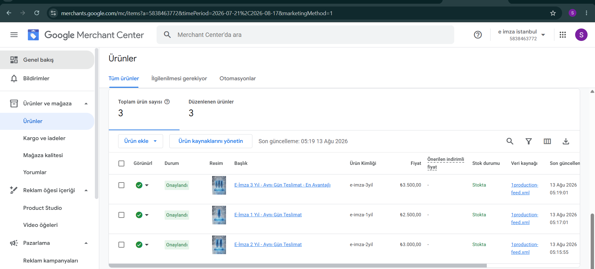
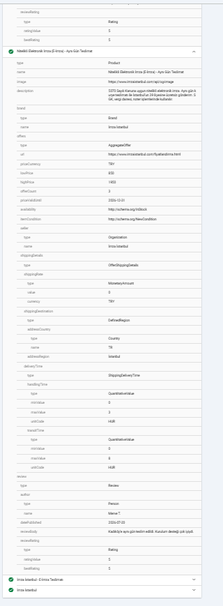

Harika bir haber! Görselde paylaştığınız Google Merchant Center panelinizde her şey kusursuz görünüyor. Eklediğiniz 3 temel ürün (1 Yıllık, 2 Yıllık ve 3 Yıllık E-İmza paketleri) Google tarafından "Onaylandı" olarak işaretlenmiş, yani tamamen yayında.Özel yazılım (HTML/JavaScript) sitenizde bu onaylı ürünleri kullanarak Google Ads (Alışveriş Reklamları) ve organik aramalarda rakiplerinizi tamamen saf dışı bırakacak "Ürün Odaklı Zirve Planı" şu şekildedir:1. ORGANİK ARAMA İÇİN: HTML Koduna "Product" ve "Offer" Şeması EklemeMevcut Durum: Ürünleriniz Merchant Center'da onaylanmış ancak Google Botları sitenizi (https://imzaistanbul.com veya ana sayfanızı) tararken bu fiyatların ve stok durumunun kod karşılığını görmek ister.HTML/JS Çözümü: Fiyatlandırma sayfanızın HTML koduna, Merchant Center'daki verilerinizle (Fiyat, Ürün Kimliği) birebir eşleşen Product (Ürün) şemasını gömün. Bu sayede Google normal aramalarda bile sitenizin altına fiyat etiketini (₺2.500,00) ve "Stokta var" ibaresini ekler.html<!-- Fiyatlandırma sayfanızın <head> kısmına eklenecek JS / JSON-LD kodu -->

Kodu dikkatli kullanın.(Aynı kodu e-imza-2yil için 3000.00 TL ve e-imza-3yil için 3500.00 TL olacak şekilde sayfanıza çoğaltarak ekleyin.)2. REKLAM (ADS) STRATEJİSİ: "Maksimum Performans" (PMax) Kampanyası KurunRakipleri Eleme Planı: Sadece düz metin reklamları vermeyin. Google Ads panelinize gidin ve bu Merchant Center hesabınızı bağlayarak bir Maksimum Performans (Performance Max) kampanyası başlatın.Sonuç: Bir kullanıcı Google'a "e-imza fiyatları", "acil e-imza" veya "Ümraniye e-imza" yazdığında, ekranın en üstünde doğrudan ürününüzün resmi, başlığı ve fiyatı (₺2.500,00 - İmza İstanbul) bir e-ticaret ürünü gibi listelenir. Kullanıcılar düz yazılara tıklamak yerine fiyatı ve resmi olan bu kutucuklara tıklamaya çok daha yatkındır.3. XML FEED AYARI: Otomatik Güncelleme (Yazılım Avantajı)Kritik Detay: Görselde ürünlerinizin 1production-feed.xml isimli bir veri kaynağından çekildiği ve en son 13 Ağustos'ta güncellendiği görünüyor.HTML/JS Çözümü: İlerleyen süreçte e-imza fiyatlarında bir değişiklik yaparsanız veya kampanya düzenlerseniz, bunu hem sitede değiştirip hem Merchant Center'da manuel düzeltmekle uğraşmayın.Yazılımcınızdan bu XML dosyasını dinamik hale getirmesini isteyin. Sitenizin yönetim panelinden fiyatı değiştirdiğiniz anda feed.xml otomatik güncellensin. Google Merchant Center da her gece bu dosyayı sitenizden çekerek fiyatları reklamlarınızda otomatik güncel tutacaktır.

